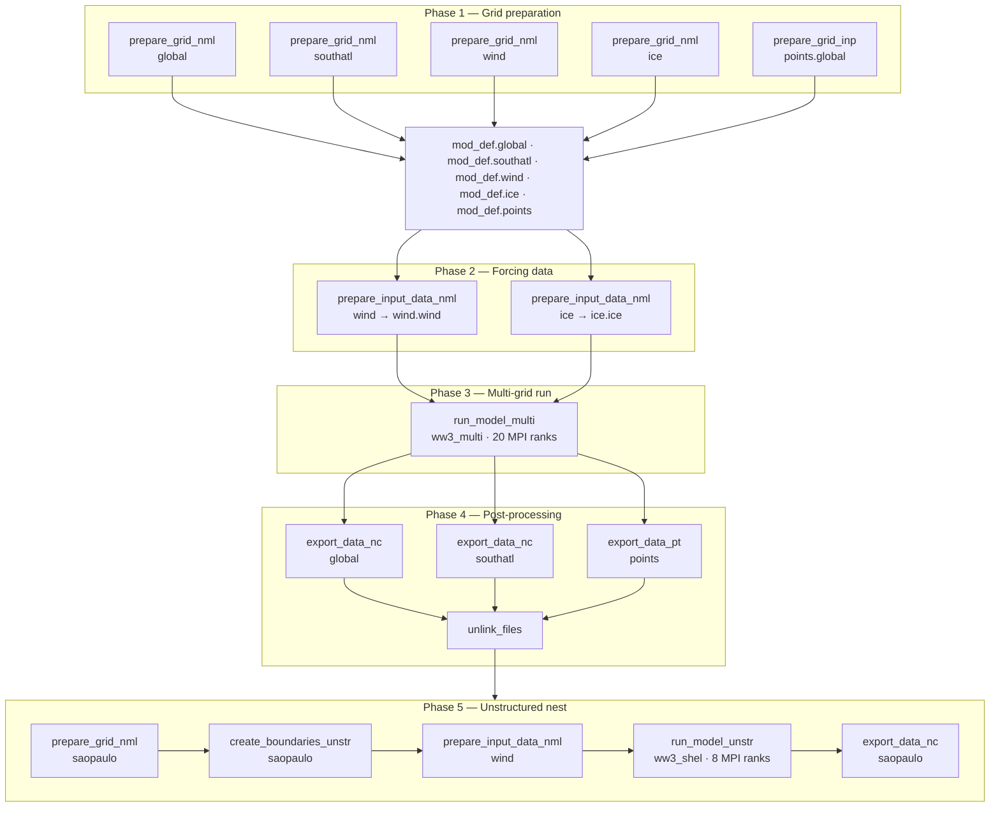

# WaveWatch III — Pixi-based Workflow

A reproducible environment and helper-function library for running [NOAA-EMC WaveWatch III](https://github.com/NOAA-EMC/WW3) on Linux using [Pixi](https://pixi.sh).


---

## Prerequisites

| Tool | Notes |
|------|-------|
| [Pixi](https://pixi.sh) | `curl -fsSL https://pixi.sh/install.sh | bash` |
| Git | for cloning WW3 |
| Linux x86-64 | only supported platform in `pixi.toml` |

All compilers, MPI, NetCDF-Fortran, CMake and ncview are managed by Pixi — no system-level installs required.

---

---

## Repository layout

```
.
├── pixi.toml                  # environment & dependency declaration
├── experiments/
│   └── ww3_functions.sh       # helper functions       (sourced on activation)
├── input/                     # namelist/input templates
├── data_inp/                  # preprocessed data      (not distributed here)
├── work/                      # working directory      (you can delete everything here at any time)
├── output/                    # gridded NetCDF results (written at runtime, delete at any time)
└── boundary/                  # boundary spectra       (written at runtime, delete at any time)
```


## Installation

### 1. Clone this repository

```bash
git clone <this-repo-url>
cd ww3_pixi
```

### 2. Activate the Pixi environment

```bash
pixi shell
```

This resolves and downloads all packages declared in `pixi.toml` into `.pixi/` and exports the environment variables (`CC`, `FC`, `pixi_root`, `PATH`) and sources `ww3_functions.sh`.

### 3. Build WaveWatch III

```bash
./install.sh
```

This clones WW3 from GitHub into the project root and builds it. After a successful build the directory structure under `WW3/` looks like:

```
WW3/
└── build/
    ├── switch                  ← copy of the switch file used
    ├── CMakeCache.txt
    ├── model/                  ← compiled objects and intermediate files
    └── install/                ← final installed files (CMAKE_INSTALL_PREFIX=install)
        ├── bin/                ← executables (ww3_grid, ww3_shel, ww3_multi, etc.)
        └── lib/                ← libraries (if built)
```

The switch file (`switch_UoM_nl1`) was taken from the WW3 source tree. The current configuration uses **ST6** (source terms) + **SNL1** (nonlinear interactions), among other options. Changing the switch file requires a full recompile.

> **What `install.sh` does internally:**
> 1. Sets `NetCDF_ROOT` to `$CONDA_PREFIX/bin` so CMake can find the NetCDF libraries installed by Pixi.
> 2. Clones the official NOAA-EMC WW3 repository.
> 3. Configures the build pointing to the switch file and sets the install prefix to `WW3/build/install`.
> 4. Compiles and installs binaries under `WW3/build/bin/`.


All executables are automatically added to `PATH` for every subsequent `pixi shell` session via `[activation.env]` in `pixi.toml`.

---

## WW3 executables

Preprocessing tools and the model executable are located in `WW3/build/bin`. The table below covers the main ones (not exhaustive).

| Executable | Purpose |
|---|---|
| `ww3_grid` | Grid pre-processing. Runs first. Produces `mod_def.ww3`. |
| `ww3_prnc` | Pre-processes NetCDF forcing (wind, current, ice) into `.ww3` binaries. |
| `ww3_prep` | Same as `ww3_prnc` but for binary forcing inputs. |
| `ww3_shel` | Single-grid model run. |
| `ww3_multi` | Multi-grid run (nesting). Replaces `ww3_shel` for coupled grids. |
| `ww3_ounf` | Post-processes gridded output to NetCDF. |
| `ww3_ounp` | Post-processes point output (spectra, mean params) to NetCDF. |
| `ww3_bounc` | Generates spectral boundary conditions for a nested grid. |
| `ww3_trnc` | Truncates a restart file to a given time. |
| `ww3_uprstr` | Modifies fields inside a restart file. |

---

## WW3 input files

Each executable reads its corresponding input file (`.nml` or `.inp`) from the **current working directory** at runtime. Reference copies live in `WW3/model/inp` and `WW3/model/nml`; the helper functions in `ww3_functions.sh` copy or symlink the appropriate file before each run.

| Input file | Executable | Format | Purpose |
|---|---|---|---|
| `ww3_grid.nml` | `ww3_grid` | `.nml` | Grid geometry, spectral discretization, timesteps, bathymetry/mask paths |
| `ww3_prnc.nml` | `ww3_prnc` | `.nml` | NetCDF forcing variable mapping (field name, units, grid) |
| `ww3_shel.nml` | `ww3_shel` | `.nml` | Run period, output times, output fields, forcing flags |
| `ww3_multi.nml` | `ww3_multi` | `.nml` | Grid list, nesting topology, run period, output fields |
| `ww3_ounf.nml` | `ww3_ounf` | `.nml` | Output time range, variables to extract, NetCDF version |
| `ww3_ounp.nml` | `ww3_ounp` | `.nml` | Point output type (spectra / mean params), time range, NetCDF version |
| `ww3_bounc.nml` | `ww3_bounc` | `.nml` | Source spectral file and target boundary definition |


---

## Running an experiment

Enter the working directory for your experiment and source the helpers (already done automatically on activation):

```bash
pixi shell
cd experiments/work
source ../ww3_functions.sh
```

The `ww3_functions.sh` contain several functions that link input namelist to `experiments/work` and use the executables we compiled earlier, Below is an example of how to prepare a nested Global + South Atlantic Grid.


```
    prepare_grid_nml global
    prepare_grid_nml southatl
    prepare_grid_nml wind
    prepare_grid_nml ice
    prepare_grid_inp points.global

    prepare_input_data_nml wind
    prepare_input_data_nml ice

    run_model_multi multi 20

    export_data_nc global
    export_data_nc southatl
    export_data_pt points

    mv glob*nc   ../output
    mv south*nc  ../output
    mv ww3.BOUND*nc ../boundary
```


Below is a visual diagram (not compreehensive of what we are doing)




---


The ww3_function.sh is **not** a self-contained runner — it is a library of thin wrappers around WW3 binaries. Each function follows the same contract: receive a grid/component `name`, set up symlinks and copy the right namelist, run the binary, then clean up. For details on each function, the reader is referred to `ww3_functions.sh`.


## Environment variables set by Pixi

| Variable | Value | Purpose |
|----------|-------|---------|
| `CC` | `gcc` | C compiler for CMake |
| `FC` | `gfortran` | Fortran compiler for CMake |
| `pixi_root` | `$CONDA_PREFIX` | Used by `build_ww3.sh` to locate NetCDF |
| `PATH` | `…:WW3/build/bin` | Makes WW3 binaries available globally |

---

## Notes

- The **switch file** (`switch_UoM_nl1`) controls which physics packages are compiled in. Changing it requires a full recompile.
- All helper functions follow a **symlink-then-run-then-unlink** pattern to keep the working directory clean and allow the same directory to be reused across grid configurations.
- `ww3_prnc.nml` is copied (not symlinked) and made writable because some WW3 versions write back into the namelist during execution.