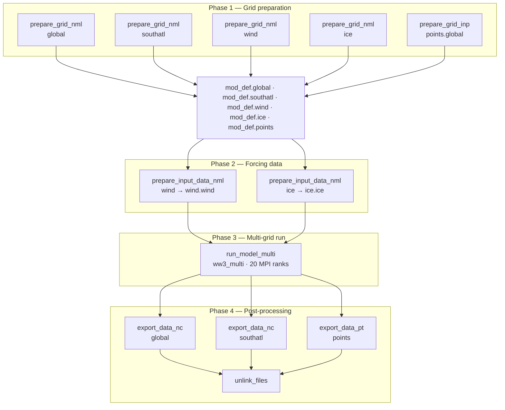

# WaveWatch III — Pixi-based Workflow

A reproducible environment and helper-function library for running [NOAA-EMC WaveWatch III](https://github.com/NOAA-EMC/WW3) on Linux using [Pixi](https://pixi.sh).

## Prerequisites

| Tool | Notes |
|------|-------|
| [Pixi](https://pixi.sh) | `curl -fsSL https://pixi.sh/install.sh \| bash` |
| Git | for cloning WW3 |
| Linux x86-64 | only supported platform |

All compilers, MPI, NetCDF-Fortran, CMake, and ncview are managed by Pixi — no system-level installs required.


**Note**: This repository is set up as a working example using realistic wind and ice forcing with a specific WW3 physics configuration (ST6 + SNL1). WW3 is a flexible framework and supports a wide range of setups — idealized simulations, different source term packages, alternative grid configurations, and more. Treat this as a starting point, not a reference configuration.

## Quick start

```bash
git clone https://github.com/dksasaki/ww3_pixi.git
cd ww3_pixi
pixi shell          # activate environment
./install.sh        # compile and install WW3
cd experiments/work
source ../ww3_functions.sh
```

Download the [datasets](https://www.dropbox.com/scl/fi/ay13wehh0en4yfboa8hun/data.tar.gz?rlkey=g59yea1o2ex5xafllqkw7qxlg&st=q47uo56v&dl=0)  and copy its contents to `experiments/data_inp`.

From there, a typical nested Global + South Atlantic run looks like:

```bash
prepare_grid_nml global
prepare_grid_nml southatl
prepare_grid_nml wind
prepare_grid_nml ice
prepare_grid_inp points.global

prepare_input_data_nml wind
prepare_input_data_nml ice

run_model_multi multi 20

export_data_nc global
export_data_nc southatl
export_data_pt points

mv glob*nc  ../output
mv south*nc ../output
mv ww3.BOUND*nc ../boundary
```

## Repository layout

```
.
├── pixi.toml                  # environment & dependency declaration
├── install.sh                 # downloads and compiles WW3
└── experiments/
    ├── ww3_functions.sh       # helper function library
    ├── input/                 # namelist/input templates
    ├── data_inp/              # preprocessed data      (not distributed)
    ├── work/                  # working directory      (safe to delete)
    ├── output/                # gridded NetCDF results (written at runtime)
    └── boundary/              # boundary spectra       (written at runtime)
```

## Installation details

### 1. Activate the Pixi environment

```bash
pixi shell
```

This resolves and downloads all packages declared in `pixi.toml` into `.pixi/`, and exports environment variables (`CC`, `FC`, `pixi_root`, `PATH`).

| Variable | Value | Purpose |
|----------|-------|---------|
| `CC` | `gcc` | C compiler for CMake |
| `FC` | `gfortran` | Fortran compiler for CMake |
| `pixi_root` | `$CONDA_PREFIX` | Used by `install.sh` to locate NetCDF |
| `PATH` | `…:WW3/build/bin` | Makes WW3 binaries available globally |

### 2. Build WaveWatch III

```bash
./install.sh
```

`install.sh` sets `NetCDF_ROOT`, clones the official NOAA-EMC WW3 repository, configures CMake using the switch file `switch_UoM_nl1`, and installs binaries under `WW3/build/install/bin/`. After a successful build:

```
WW3/
└── build/
    ├── switch                  ← copy of the switch file used
    ├── CMakeCache.txt
    ├── model/
    └── install/
        ├── bin/                ← executables (ww3_grid, ww3_shel, ww3_multi, …)
        └── lib/
```

> **Note:** The switch file controls which physics packages are compiled in (currently **ST6** + **SNL1**). Changing it requires a full recompile.

## WW3 executables and input files

Executables live in `WW3/build/bin/`. Each reads its corresponding namelist (`.nml`) from the current working directory at runtime. Reference copies are in `WW3/model/nml`; the helpers in `ww3_functions.sh` copy or symlink the right file before each run and clean up afterward.

| Executable | Input file | Purpose |
|---|---|---|
| `ww3_grid` | `ww3_grid.nml` | Grid pre-processing; produces `mod_def.ww3` |
| `ww3_prnc` | `ww3_prnc.nml` | Pre-processes NetCDF forcing (wind, ice) into `.ww3` binaries |
| `ww3_prep` | — | Same as `ww3_prnc` but for binary inputs |
| `ww3_shel` | `ww3_shel.nml` | Single-grid model run |
| `ww3_multi` | `ww3_multi.nml` | Multi-grid run with nesting |
| `ww3_ounf` | `ww3_ounf.nml` | Post-processes gridded output to NetCDF |
| `ww3_ounp` | `ww3_ounp.nml` | Post-processes point output to NetCDF |
| `ww3_bounc` | `ww3_bounc.nml` | Generates spectral boundary conditions for nested grids |
| `ww3_trnc` | — | Truncates a restart file to a given time |
| `ww3_uprstr` | — | Modifies fields inside a restart file |

## Helper functions (`ww3_functions.sh`)

`ww3_functions.sh` is a library of thin wrappers around WW3 binaries. Each function receives a grid or component name, symlinks the appropriate namelist into the working directory, runs the binary, and unlinks afterward. See the file directly for implementation details.

```bash
source ../ww3_functions.sh   # if not already loaded
```

## Workflow diagram

